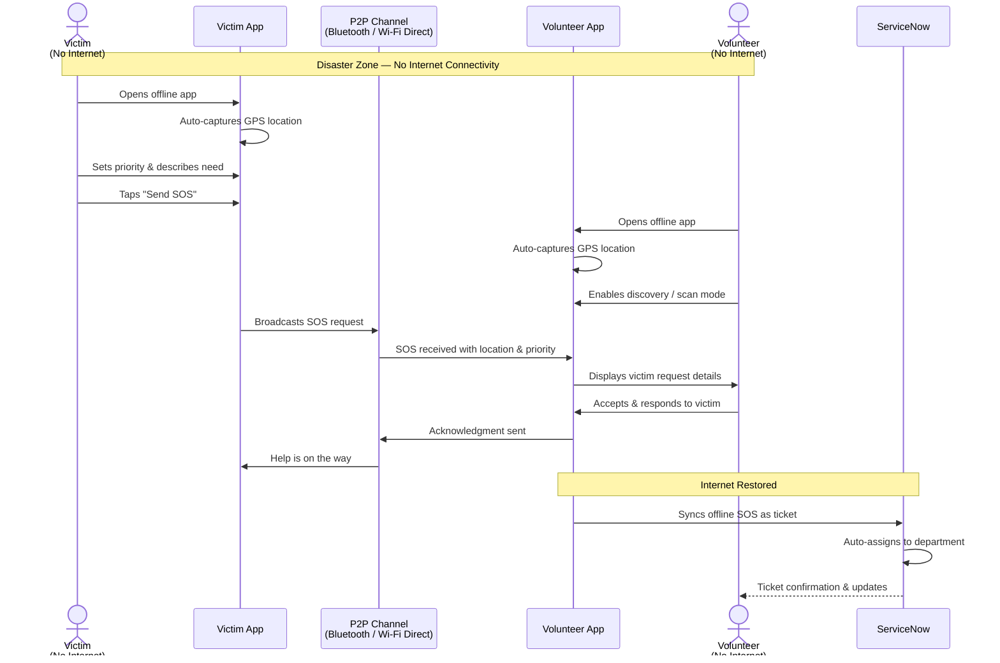

<div align="center">
  <table><tr><td bgcolor="white" align="center">
    
  </td></tr></table>
</div>

<h1 align="center">ResQLink</h1>

<p align="center">
  <strong>Real-Time Disaster Management & Civic Response Platform</strong><br/>
  Built on ServiceNow · By Team NowSquad · SNU HackNow India 2025
</p>

<p align="center">
  
  
  
</p>

<p align="center">
  <a href="https://youtu.be/oHa1zSCVmkA">🎬 Watch Demo Video</a> ·
  <a href="https://nowsquad.vercel.app/">🌐 Visit Website</a>
</p>

---

## The Problem

During disasters like floods, cyclones, or earthquakes, the biggest challenge is **communication and coordination** between authorities, volunteers, and victims:

- **Victims** struggle to raise SOS requests, especially with no internet connectivity
- **Volunteers** lack proper channels to report resources or receive assignments
- **Authorities** face delays in tracking rescue operations and coordinating response

This leads to **slow response times and loss of lives**.

---

## Our Solution

**ResQLink** is a unified, real-time disaster management platform that connects **citizens, volunteers, and authorities** on a single intelligent system — powered by **ServiceNow**.

We provide two core services:

| Service | Description |
|---------|-------------|
| **🔴 Post-Disaster Response** | SOS requests, volunteer matching, task routing, real-time tracking, and resource management |
| **🟡 Pre-Disaster Preparedness** | Live weather monitoring, predictive alerts using ML/NLP, automated mass notifications |

### What Makes Us Different

- **Online + Offline Capability** — Our Android app works even **without internet** using peer-to-peer connectivity between victims and nearby volunteers
- **End-to-End Automation** — Predictive analytics, auto-ticket assignment, SLA tracking, and role-based workflows — all within one ServiceNow instance
- **Multi-Stakeholder Platform** — Tailored portals and workspaces for every user role

---

## Architecture Overview

```mermaid
flowchart TB
    subgraph Users["User-Facing Layer"]
        CP["Citizen Portal"]
        VP["Volunteer Portal"]
        DP["Department Portal"]
        AW["Admin Workspace"]
        OW["Officer Workspace"]
    end

    subgraph SN["ServiceNow Platform"]
        SP["Service Portal"]
        FD["Flow Designer"]
        PA["Performance Analytics & Dashboards"]
        IH["IntegrationHub"]
        NM["Now Mobile"]
        KB["Knowledge Base"]
        NF["Notifications - SMS / Email / Push"]
    end

    subgraph EXT["External Integrations"]
        OWM["OpenWeatherMap API"]
        GM["Google Maps API"]
        IMD["IMD / NOAA / USGS"]
    end

    subgraph OFFLINE["Offline Layer"]
        APK["Android APK"]
        P2P["P2P via Bluetooth / Wi-Fi Direct"]
    end

    CP & VP & DP --> SP
    AW & OW --> FD
    SP --> FD
    FD --> PA
    FD --> NF
    IH --> OWM & GM & IMD
    NM --> APK
    APK --> P2P
    SP --> KB
    FD --> IH
```



---

## Portals & Workspaces

### 1. Citizen Portal
> For citizens during emergencies

- **Emergency Alerts** — Real-time disaster warnings (earthquake, flood, cyclone)
- **Submit Request** — Create and send help requests with location data
- **My Requests** — Track the status of earlier submitted requests
- **Live Location Map** — Auto-shares location so responders can identify where help is needed
- **Get Help** — Direct connection to support and guidance

### 2. Volunteer Portal
> For volunteers managing ground operations

- **Active Tasks** — View tasks currently assigned based on location and skills
- **My Tasks** — Review previous and ongoing task history
- **Submit & Track Requests** — Raise new requests and monitor progress
- **Live Location Map** — Enables coordinators to assign tasks effectively
- **Get Help** — Direct assistance channel

### 3. Department Portal
> For government department officials

- **Active Tasks** — View and manage assigned department tasks
- **Task History** — Access complete history of previously assigned work
- **Submit Requests** — Report problems in nearby areas
- **Announcements** — Stay informed about broadcast alerts
- **Knowledge Base** — Access categorized articles and FAQs for department operations

### 4. Department Officer Workspace
> For ground-level rescue officers

- **Dashboard** — Summary of active alerts and pending approvals
- **Alert List** — All department alerts with risk scores and affected zones
- **Task Approval** — Review, approve, or reject tasks for coordination
- **Schedules** — Upcoming drills, inspections, and preparedness events
- **Department Sections** — Health, Fire, Roads & Infrastructure, Municipal — each with dedicated alerts and tasks

### 5. Admin Workspace
> For platform administrators

- **Command Center** — Create alerts, assign volunteers, view tickets, generate reports
- **Dashboard** — Bird's-eye view of alerts, tickets, schedules, volunteers with SLA/KPI metrics
- **Alert Management** — View all alerts with category, risk score, and affected zones
- **Feedback System** — Categorized feedback with status, source, priority, and date range
- **Schedule Management** — Plan training drills, awareness drives, and preparedness activities

---

## Offline SOS App

One of the most innovative features of ResQLink is the **offline Android application** for disaster scenarios where internet connectivity is unavailable.

### How It Works



1. **Victim** opens the app → auto-captures GPS location → selects priority and describes need → sends SOS
2. **Volunteer** enables discovery mode → detects victims in the locality via P2P
3. The devices connect without internet and the SOS request is transmitted
4. When connectivity is restored, the ticket is synced to the ServiceNow platform

> [Download the Offline App (APK)](public/apk/HackNow%20Offline%20App!!.apk)

---

## Live Weather Monitoring Dashboard

The landing page features an **India Weather Monitoring Dashboard** with:

- **Interactive Google Map** with color-coded alert markers (red = heavy, orange = moderate, yellow = light)
- **Real-time weather data** from OpenWeatherMap API (temperature, humidity, wind speed, pressure, sunrise/sunset)
- **Alert sidebar** listing active weather warnings across regions
- **City search** to check weather conditions for any location

---

## Tech Stack

### ServiceNow Platform
| Module | Usage |
|--------|-------|
| **Service Portal** | Citizen, Volunteer, and Department Portals |
| **App Engine Studio** | Admin and Officer custom workspaces |
| **Flow Designer** | Automated ticket routing and workflow orchestration |
| **IntegrationHub** | Real-time API integrations (weather, seismic data) |
| **Performance Analytics** | KPI dashboards, SLA monitoring, heatmaps |
| **Now Mobile** | Cross-platform mobile access with offline capability |
| **Knowledge Base** | Self-service articles for department operations |
| **Notifications** | SMS, email, and push notification broadcasting |

### Landing Page (This Repository)
| Technology | Purpose |
|------------|---------|
| **React 19** | UI component framework |
| **Vite 7** | Build tool and dev server |
| **Tailwind CSS 4** | Utility-first styling |
| **Framer Motion** | Scroll animations and transitions |
| **React Router DOM** | Client-side routing |
| **Google Maps API** | Interactive weather alert map |
| **OpenWeatherMap API** | Real-time weather data |
| **Axios** | HTTP client for API calls |

---

## Getting Started

### Prerequisites
- **Node.js** v18+ and npm
- API keys for Google Maps and OpenWeatherMap

### Installation

```bash
# Clone the repository
git clone https://github.com/agrawalvansh/NowSquad.git
cd NowSquad

# Install dependencies
npm install

# Create environment file
cp .env.example .env
```

### Environment Variables

Create a `.env` file in the root directory:

```env
VITE_GOOGLE_MAPS_API_KEY=your_google_maps_api_key
VITE_OPENWEATHERMAP_API_KEY=your_openweathermap_api_key
```

### Running Locally

```bash
# Start development server
npm run dev

# Build for production
npm run build

# Preview production build
npm run preview
```

The app will be available at `http://localhost:5173`

---

## Project Structure

```
NowSquad/
├── public/
│   ├── apk/                    # Offline Android APK
│   ├── docs/                   # Project documentation
│   ├── logo/                   # Brand assets and favicons
│   └── teamImgs/               # Team member photos
├── src/
│   ├── Pages/
│   │   └── landingPage/
│   │       ├── Header.jsx      # Navigation bar with video modal
│   │       ├── LandingPage.jsx # Weather monitoring dashboard
│   │       ├── About.jsx       # Mission, solution steps, user roles
│   │       ├── FAQs.jsx        # Frequently asked questions
│   │       ├── Team.jsx        # Team member cards
│   │       ├── Footer.jsx      # Site footer
│   │       └── landingPageLayout.jsx  # Page composition layout
│   ├── App.jsx                 # Router configuration
│   ├── main.jsx                # Application entry point
│   └── index.css               # Global styles
├── .env                        # Environment variables (not committed)
├── package.json                # Dependencies and scripts
├── vite.config.js              # Vite configuration
└── README.md                   # You are here
```

---

## 🎬 Demo

<p align="center">
  <a href="https://youtu.be/oHa1zSCVmkA">
    
  </a>
</p>

---

## Achievement

<p align="center">
  
</p>

<p align="center">
  <em>Team NowSquad receiving the 2nd Prize at SNU HackNow India 2025</em>
</p>

> **🥈 2nd Prize Winner** at **SNU HackNow India 2025** — a national-level hackathon with **263+ participating teams** from across India. ResQLink stood out for its innovative approach to disaster management, combining ServiceNow’s enterprise platform with offline P2P communication to bridge the critical gap during emergencies.

### Detailed Documentation

For a deeper dive into the project, refer to our original hackathon submission materials:

| Document | Description |
|----------|-------------|
| [NowSquad_GITAM University.pdf](public/docs/NowSquad_GITAM%20University.pdf) | Project presentation and overview slides |
| [NowSquad_Idea_SNU HackNow India.docx](public/docs/NowSquad_Idea_SNU%20HackNow%20India.docx) | Detailed idea document with architecture, features, and implementation plan |

---

## Team NowSquad

Built with ❤️ by **Team NowSquad** from **GITAM University**

| Name | Role |
|------|------|
| **Vansh Agrawal** | Team Lead |
| **Bandi Gayathri** | ServiceNow Developer |
| **Munagapati Bhavana** | ServiceNow Developer |
| **Kaditham Gowtham** | UI/UX Designer |
| **Rudraksha Ravinder** | ServiceNow Developer |
| **Vivek Kumar Pradhan** | Tester |

---

## License

This project was built as part of the **SNU HackNow India** hackathon. All rights reserved by Team NowSquad.

---

<p align="center">
  <sub>🔗 Connecting lives. Saving time. Rescuing hope.</sub>
</p>
